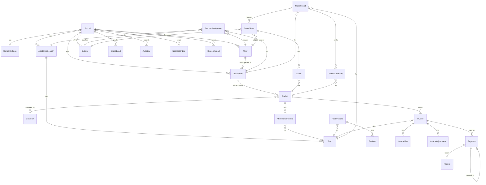

# Data model

Every table except `School` carries `school_id` (tenant), `created_at` and `updated_at`.

## Entities

### Accounts and school

| Model | Key fields | Notes |
|---|---|---|
| `User` | email (login), first/last name, phone, `school`, `role`, `must_change_password`, `is_active` | Staff only. Superusers have no school |
| `School` | name, slug, address, phone, email, motto, logo | The tenant |
| `SchoolSettings` | `ca1_max`/`ca2_max`/`exam_max` (=100), part-payment rules, invoice/receipt prefixes, `hold_report_cards_for_debtors` | One per school |
| `AcademicSession` | name (`2026/2027`), dates, `is_current` | |
| `Term` | session, `name` (`first`/`second`/`third`), dates, `is_current` | Exactly one current term per school (set via `set-current`) |
| `ClassRoom` | `level` (`JSS1`…`SS3`), `arm` (`A`, `Gold`…), `class_teacher` | Displayed as "JSS 2A" |
| `Subject` | name, code | |
| `TeacherAssignment` | session, classroom, subject, teacher | Unique per (session, classroom, subject) |
| `GradeBand` | grade, min_score, max_score, remark | Matched by `total >= min_score` from the top |

### Students

| Model | Key fields | Notes |
|---|---|---|
| `Student` | admission_number (unique per school), names, gender, DOB, `classroom`, `status` (`active`/`suspended`/`withdrawn`/`graduated`), photo | Many-to-many `guardians` |
| `Guardian` | names, relationship, phone, email, address | Shared between siblings |
| `StudentImport` | file, status, column_mapping, totals, error_rows | Preview then commit |

### Attendance

| Model | Key fields | Notes |
|---|---|---|
| `AttendanceRecord` | student, classroom, term, date, `status`, note, marked_by | Unique per (student, date) |

### Fees

| Model | Key fields | Notes |
|---|---|---|
| `FeeStructure` | term, level, items | Unique per (term, level) |
| `FeeItem` | name, amount_kobo | |
| `Invoice` | number, student, term, classroom (snapshot), status, `subtotal_kobo`, `adjustments_kobo`, `total_kobo`, `amount_paid_kobo`, `balance_kobo` | Derived fields set only by `recalculate()`. One open invoice per student per term |
| `InvoiceLine` | description, amount_kobo | Copied from the fee structure |
| `InvoiceAdjustment` | kind (`discount`/`scholarship`/`waiver`/`surcharge`), amount_kobo, reason | Discount kinds reduce the total |
| `Payment` | invoice, amount_kobo (negative for reversals), method, status (`pending`/`successful`/`failed`), reference (ours, unique), external_reference, channel, paid_at, `reversal_of` | Never edited or deleted |
| `Receipt` | payment, number, amount_kobo, balance_after_kobo | Snapshot at time of payment |

### Results

| Model | Key fields | Notes |
|---|---|---|
| `ClassResult` | term, classroom, `status` (`open`/`in_review`/`approved`/`published`), class_average, approved/published by/at, next_term_begins | One per class per term |
| `ScoreSheet` | class_result, subject, teacher, `status` (`draft`/`submitted`/`returned`), return_note | One per subject per class per term |
| `Score` | sheet, student, ca1, ca2, exam, total, grade, remark | Decimals (2 places). Total only when all three are present |
| `ResultSummary` | class_result, student, total, average, subjects_count, position, class_size, comments | Recomputed on review, approve and publish |

### Platform

| Model | Notes |
|---|---|
| `AuditLog` | actor, role, action, object, `changes` (before/after), metadata, IP, user agent. Append-only |
| `NotificationLog` | Every SMS or email sent, with status |
| `Sequence` | Per-school counters for invoice and receipt numbers |

## Database notes

* SQLite is the default. Set `DB_ENGINE=postgres` for PostgreSQL. No code changes are needed.
* Money columns are `BigIntegerField` (kobo).
* Important uniqueness rules are database constraints, not just validation: admission numbers, invoice and receipt numbers, one open invoice per student per term, one attendance record per student per day, one score per student per sheet.
* `on_delete=PROTECT` on links from financial and academic history to students and terms, so history cannot vanish by accident.
